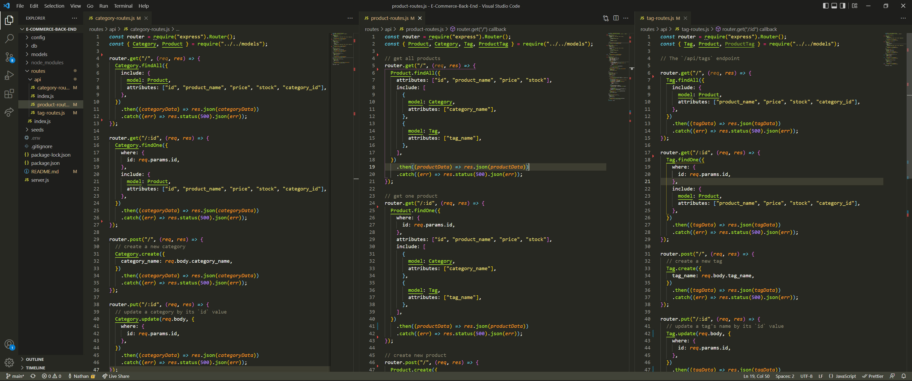

# E-commerce Back End

   https://opensource.org/licenses/MIT

---

  ### Table of contents
  * [Description](#description)
  * [Installation](#installation)
  * [Usage](#usage)
  * [License](#license)
  * [Questions](#questions)
  * [Links](#links)
  * [Images](#images)

---

  ## Description 
  mysql database using inquirer, express, sequelize, mysql2 for an E-commerce business that allows you to add, update, and delete things fromt the database.

---

  ## Installation
  to install please run this command

  mysql -u root -p  

  password = pswrd 

  source db/schema.sql;

  exit

  npm run seed

  npm start

---

  ## Usage
  E-commerce database

---

  ## License
   project is using MIT

---

  ## Questions
  https://github.com/batemanz

---

  ## links
  [Youtube video of application](https://youtu.be/TDovsEfBc5U)

---

  ## images
  

